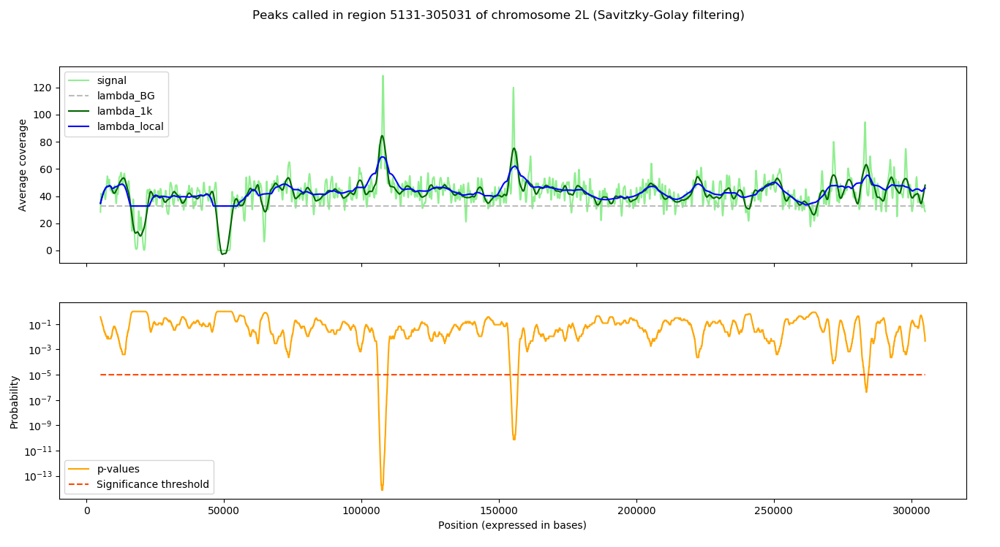

# ChIP-seq peak calling

This repository hosts the implementation of a minimalist
peak caller based on Savitzky-Golay filtering and
Poisson modelling, intended to be used on ChIP-seq data.

Load a bedGraph file: tags are assumed to be equally
spaced (e.g. 100 bases).

```python
from chipseq.io import BedGraphIO

filepath = ... # Location of the bedGraph file
chromosomes = BedGraphIO.read(filepath)
```

Call peaks on each chromosome separately:

```python
from chipseq import call_peaks

alpha = 1e-5 # Significance threshold
called_peaks = { c.name: call_peaks(
        c, alpha=alpha, apply_filter=False) for c in chromosomes }
```

Write the results in a text file:

```python
BedGraphIO.write(called_peaks.values(), 'chipseq.out')
```

Illustration of the method on the 3000 first tags
of chromosome 2L of Drosophila melanogaster.



### Installation

The peak caller can be installed with the following command:

```
python setup.py install
```

### Dependencies

* Numpy
* Scipy
